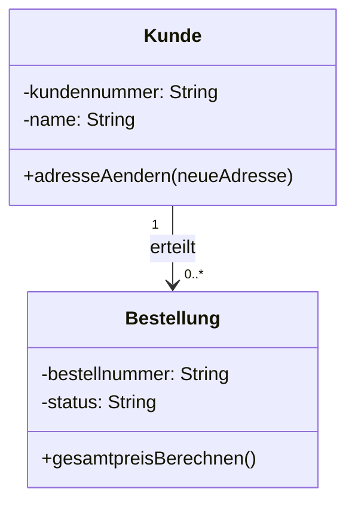
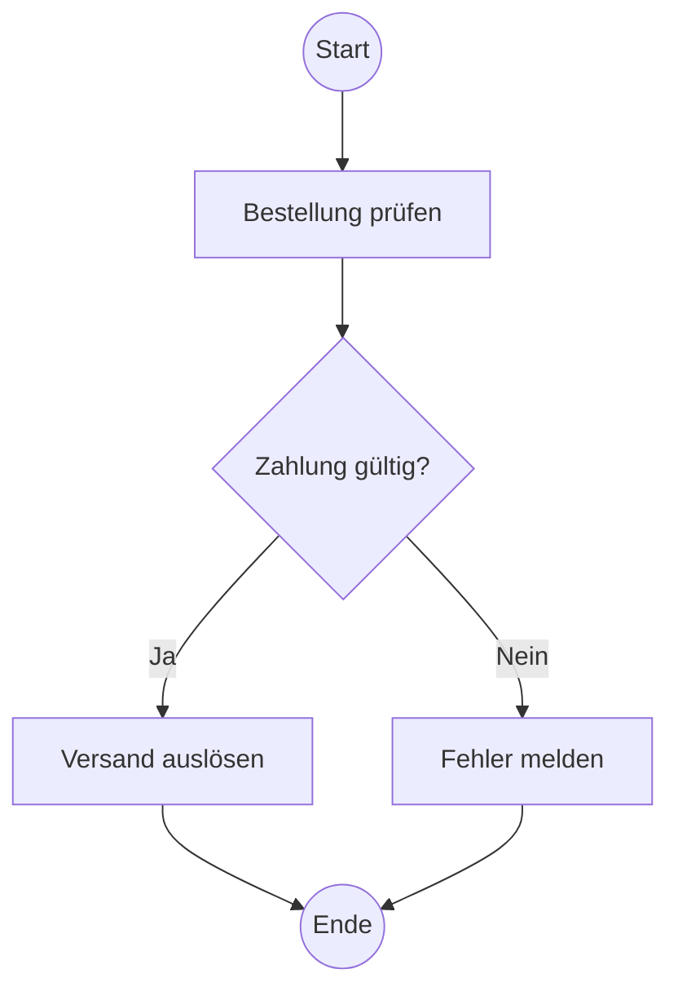

# UML: Use Case, Klassendiagramm und Aktivitätsdiagramm

## Anwendungsfalldiagramm / Use Case

Zeigt, welche Akteure welche fachlichen Ziele mit einem System verfolgen.

Elemente:

```text
Akteur       → Rolle außerhalb des Systems
Use Case     → fachliche Funktion/Ziel
Systemgrenze → Umfang des betrachteten Systems
```

`include`: Ein Anwendungsfall benötigt den eingebundenen Teil regelmäßig.

`extend`: Optionales oder bedingtes Verhalten erweitert einen Basisfall.

Use Cases beschreiben kein detailliertes zeitliches Ablaufdiagramm.

## Klassendiagramm

Eine Klasse enthält Name, Attribute und Methoden. Sichtbarkeit:

```text
+ public
- private
# protected
```

Beispiel:



Wichtige Multiplizitäten:

```text
1      → genau eins
0..1   → optional, höchstens eins
0..*   → beliebig viele
1..*   → mindestens eins
```

## Aktivitätsdiagramm

Zeigt Ablauf, Entscheidungen und Parallelität.



Elemente:

```text
Start-/Endknoten
Aktivität
Kontrollfluss
Entscheidung und Zusammenführung
Fork/Join für parallele Abläufe
```

Guards/Bedingungen sollten sich gegenseitig ausschließen und den Fall vollständig abdecken.

## IHK-Merksätze

> Das Use-Case-Diagramm zeigt fachliche Ziele aus Sicht der Akteure; das Klassendiagramm zeigt die statische Struktur; das Aktivitätsdiagramm zeigt Abläufe und Entscheidungen.

## Selbsttest

1. Welches Diagramm zeigt Kardinalitäten zwischen Kunde und Bestellung?
2. Welches Diagramm eignet sich für einen Ablauf mit Entscheidung?
3. Ist ein konkreter Mitarbeitername ein Akteur oder ist die Rolle besser?

## Lösungen

```text
1. Klassendiagramm
2. Aktivitätsdiagramm
3. Die Rolle, z. B. Sachbearbeiter, ist normalerweise der Akteur.
```

## Offene Punkte / Korrekturen

- UML-Aufgaben zeichnen und gegen WBS-Notation prüfen.
