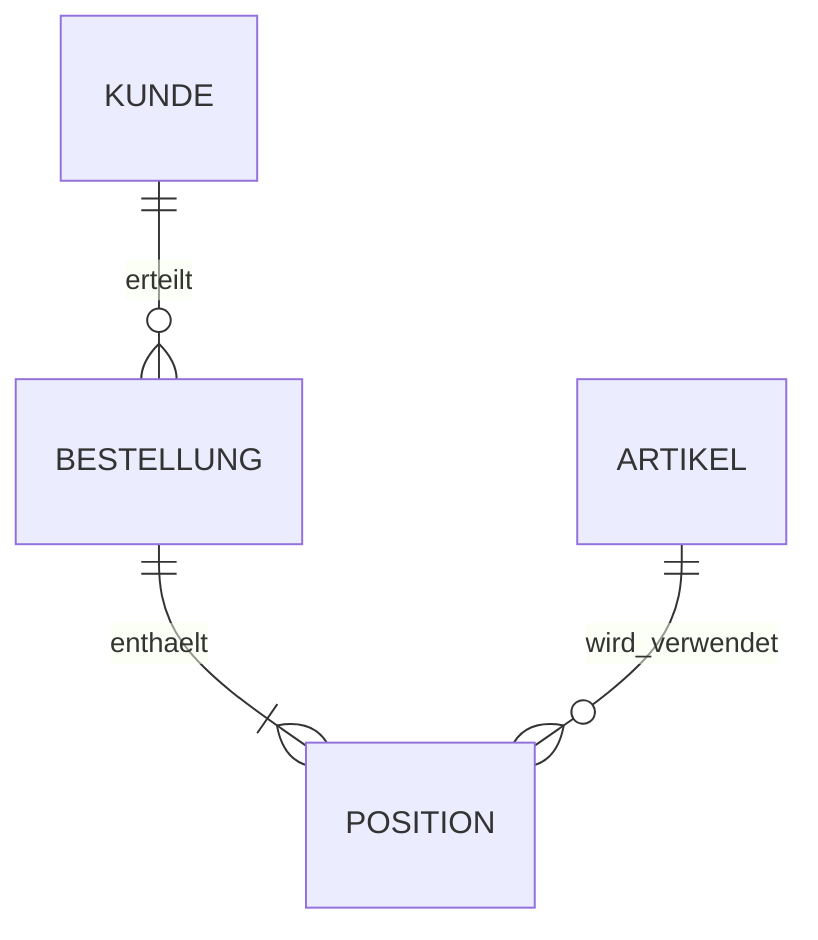

# Relationale Datenbanken – Grundlagen ohne SQL

> SQL-Abfragen sind laut zweiter Auflage des Prüfungskatalogs ausschließlich AP2. In AP1 bleiben Grundlagen relationaler Datenbanken relevant.

## Begriffe

`Datenbankmanagementsystem (DBMS)`: Software zum strukturierten Speichern, Suchen, Ändern, Schützen und gleichzeitigen Verwalten von Daten.

`Tabelle/Relation`: Sammlung gleichartig strukturierter Datensätze.

`Datensatz/Zeile/Tupel`: ein konkreter Eintrag.

`Attribut/Spalte`: ein Merkmal mit definiertem Datentyp.

`Primärschlüssel`: identifiziert einen Datensatz eindeutig und soll stabil sein.

`Fremdschlüssel`: verweist auf einen Schlüssel einer anderen Tabelle und bildet Beziehungen ab.

## Kardinalitäten

```text
1:1 → einem Datensatz entspricht höchstens/genau einer auf der anderen Seite
1:n → ein Datensatz kann viele zugeordnete Datensätze haben
n:m → viele auf beiden Seiten; wird durch Zwischentabelle aufgelöst
```

Beispiel:



Mögliche Tabellen:

```text
Kunde(KundenNr PK, Name, Adresse)
Bestellung(BestellNr PK, Datum, KundenNr FK)
Artikel(ArtikelNr PK, Bezeichnung, Preis)
Position(BestellNr PK/FK, ArtikelNr PK/FK, Menge)
```

`Position` löst die n:m-Beziehung zwischen Bestellung und Artikel auf.

## Redundanz und Anomalien

Werden Kundendaten in jeder Bestellung wiederholt, entstehen:

```text
Änderungsanomalie  → Adresse muss an vielen Stellen geändert werden
Einfügeanomalie    → Kunde kann eventuell nicht ohne Bestellung gespeichert werden
Löschanomalie      → letzte Bestellung löschen entfernt ungewollt Kundendaten
```

Durch sinnvolle Aufteilung in Tabellen und Schlüsselbeziehungen werden Redundanzen verringert. Detaillierte Normalformen nur lernen, wenn sie im verwendeten Katalog/Unterricht ausdrücklich verlangt werden.

## Datenintegrität

```text
Entitätsintegrität  → Primärschlüssel eindeutig und nicht leer
referenzielle Integrität → Fremdschlüssel verweist auf vorhandenen Datensatz oder ist erlaubt leer
Domänenintegrität   → Werte passen zu Typ, Bereich und Regeln
```

## Selbsttest

Ein Mitarbeiter kann an mehreren Projekten arbeiten; ein Projekt hat mehrere Mitarbeiter. Welche Kardinalität liegt vor und wie wird sie relational umgesetzt?

## Lösungen

> Es handelt sich um eine n:m-Beziehung. Sie wird durch eine Zwischentabelle, beispielsweise `ProjektMitarbeiter`, mit Fremdschlüsseln auf Mitarbeiter und Projekt aufgelöst.

## Offene Punkte / Korrekturen

- Keine SQL-Syntax in dieses AP1-File aufnehmen.
