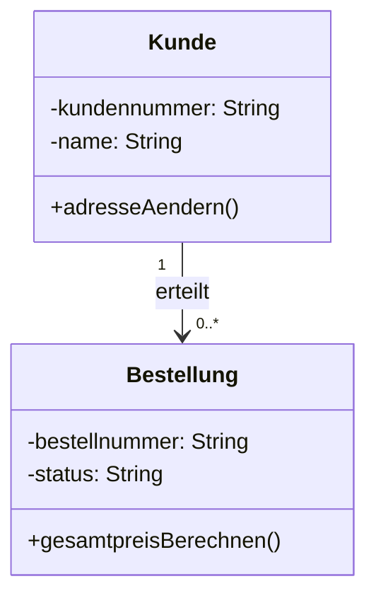
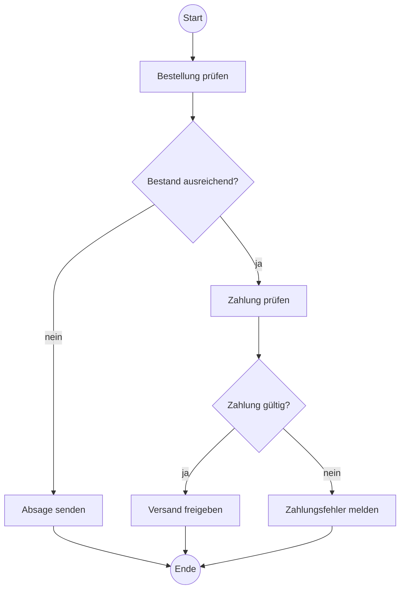

# UML: Use-Case-, Klassen- und Aktivitätsdiagramm

## 1. Lernziele

Du kannst:

- Use-Case-, Klassen- und Aktivitätsdiagramm nach Fragestellung auswählen;
- Akteure, Systemgrenze und fachliche Anwendungsfälle modellieren;
- Klassen, Attribute, Methoden, Sichtbarkeiten und Multiplizitäten lesen;
- Entscheidungen, Schleifen und Parallelität im Aktivitätsdiagramm darstellen;
- fehlerhafte Modelle erkennen und fachlich begründen korrigieren.

## 2. Prüfungsminimum — 15 Minuten

1. Use-Case-Diagramm: fachliche Ziele externer Rollen am System.
2. Klassendiagramm: statische Struktur aus Klassen, Merkmalen und Beziehungen.
3. Aktivitätsdiagramm: Ablauf, Entscheidungen und Parallelität.
4. Akteur ist eine Rolle außerhalb der betrachteten Systemgrenze, keine konkrete Person.
5. Use Case wird als fachliches Ziel mit Verb formuliert, nicht als Bildschirm oder Mausklick.
6. `<<include>>`: ein Basisfall bindet wiederverwendetes Verhalten zwingend ein.
7. `<<extend>>`: optionales/bedingtes Verhalten erweitert einen Basisfall.
8. Multiplizität steht an dem Assoziationsende, dessen Anzahl sie beschreibt.
9. Guards an einer Entscheidung sollen eindeutig und zusammen vollständig sein.
10. Fork teilt parallele Pfade, Join synchronisiert sie.

> Das Aktivitätsdiagramm wird verwendet, da nicht die statische Datenstruktur, sondern die Reihenfolge von Prüfungen, Entscheidungen und parallelen Arbeitsschritten dargestellt werden soll.

## 3. Use-Case-Diagramm

### 3.1 Elemente

| Element | Bedeutung | Beispiel |
|---|---|---|
| Akteur | externe Rolle oder externes System | Kunde, Sachbearbeiter, Zahlungsdienst |
| Use Case | fachliches Ziel/Funktion | Bestellung aufgeben |
| Systemgrenze | Umfang des betrachteten Systems | Onlineshop |
| Assoziation | Beteiligung eines Akteurs | Kunde nutzt Bestellung aufgeben |

Ein Akteur kann Mensch, Organisation, Gerät oder anderes System sein. Entscheidend ist die Rolle gegenüber dem modellierten System.

### 3.2 Gute Benennung

Gut:

```text
Bestellung aufgeben
Rechnung prüfen
Passwort zurücksetzen
```

Schlecht:

```text
Bestellmaske
Button klicken
Datenbank
```

Use Cases zeigen Ziele, keine Oberfläche und keinen detaillierten Zeitablauf.

### 3.3 Include und Extend

```text
Bestellung aufgeben --<<include>>--> Identität prüfen
Gutschein anwenden --<<extend>>--> Bestellung aufgeben
```

- `include`: Der Basisfall verwendet den eingebundenen Teil regelmäßig/zwingend.
- `extend`: Der Erweiterungsfall fügt unter einer Bedingung Verhalten zum Basisfall hinzu.

Die Pfeilrichtung ist eine häufige Fehlerquelle: `include` zeigt zum eingebundenen Use Case, `extend` zum erweiterten Basisfall.

Generalisierung kann gemeinsame Rollen oder Use Cases ausdrücken, ist für einfache AP1-Fälle aber meist weniger wichtig als korrekte Ziele und Beziehungen.

## 4. Klassendiagramm und Beziehungen

### 4.1 Aufbau einer Klasse

```text
Kunde
-------------------------
- kundennummer: String
- name: String
-------------------------
+ adresseAendern(neu: Adresse): Boolean
```

Sichtbarkeit:

```text
+ public
- private
# protected
~ package
```

Attribute beschreiben Zustand, Methoden Verhalten. Datentypen und Rückgabetypen werden angegeben, wenn die Aufgabe dies verlangt.

### 4.2 Multiplizitäten

| Zeichen | Bedeutung |
|---|---|
| `1` | genau eins |
| `0..1` | optional, höchstens eins |
| `*` oder `0..*` | null bis beliebig viele |
| `1..*` | mindestens eins |
| `2..5` | zwei bis fünf |

Beispiel:



Lesen:

- Zu jeder Bestellung gehört genau ein Kunde.
- Ein Kunde kann null bis viele Bestellungen erteilen.

### 4.3 Assoziation, Aggregation und Komposition

- `Assoziation`: allgemeine fachliche Beziehung.
- `Aggregation`: schwache Ganzes-Teil-Beziehung; Teile können unabhängig existieren.
- `Komposition`: starke Ganzes-Teil-Beziehung; Lebenszyklus des Teils ist an das Ganze gebunden.

Aggregation und Komposition nur verwenden, wenn die Lebenszyklus-Aussage fachlich belegt ist. Eine Assoziation ist besser als eine unbegründete Raute.

### 4.4 Klasse oder Objekt

`Kunde` ist eine Klasse. `kunde4711:Kunde` ist ein Objekt/eine Instanz. Ein Klassendiagramm kann Klassen modellieren; konkrete Instanzen gehören in ein Objektdiagramm oder Beispiel.

## 5. Aktivitätsdiagramm und Anwendungsfall

### 5.1 Grundelemente

| Element | Bedeutung |
|---|---|
| Startknoten | Beginn eines Ablaufs |
| Aktion | Arbeitsschritt |
| Kontrollfluss | Reihenfolge |
| Entscheidung | ein Pfad nach Guard |
| Merge | alternative Pfade zusammenführen |
| Fork | parallele Pfade erzeugen |
| Join | parallele Pfade synchronisieren |
| Endknoten | Ablaufende |

### 5.2 Bestellprozess



Guards müssen zur fachlichen Bedingung passen. `[ja]`/`[nein]` ist nur verständlich, wenn die Entscheidungsfrage eindeutig ist.

### 5.3 Parallelität

Nach erfolgreicher Zahlung können Rechnung erzeugen und Lager informieren parallel starten. Ein Join ist nur nötig, wenn ein späterer Schritt auf beide Ergebnisse warten muss.

Entscheidung und Fork nicht verwechseln:

- Entscheidung: genau ein alternativer Pfad nach Bedingung;
- Fork: mehrere Pfade laufen parallel.

### 5.4 Durchgängiger Modellierungsfall

Anforderung: Kunde bestellt, System prüft Bestand und Zahlung, erzeugt Rechnung und Versandauftrag.

Passende Sichten:

- Use Case: `Bestellung aufgeben`, Akteur `Kunde`, externer `Zahlungsdienst`;
- Klassendiagramm: `Kunde 1 — 0..* Bestellung`, `Bestellung 1 — 1..* Position`;
- Aktivitätsdiagramm: Prüfungen, Ablehnungswege, parallele Rechnung/Versandvorbereitung.

Die Diagramme widersprechen sich nicht, sondern beantworten verschiedene Fragen.

## 6. Prüfungsformulierungen

> Der Akteur wird als Rolle „Sachbearbeiter“ und nicht mit einem Personennamen modelliert, weil das Diagramm die Interaktion einer Rolle mit dem System beschreibt.

> Die Multiplizität `0..*` an der Seite der Bestellung bedeutet, dass ein Kunde noch keine oder beliebig viele Bestellungen besitzen kann.

> Der Use Case „Identität prüfen“ wird mit `<<include>>` eingebunden, da diese Prüfung bei jeder Passwortänderung zwingend ausgeführt wird.

> Ein Fork ist erforderlich, da Rechnungserstellung und Lagerbenachrichtigung unabhängig parallel beginnen können.

## 7. Typische Prüfungsfallen

- Diagrammtyp nicht zur Fragestellung passend wählen.
- konkrete Person statt Rolle als Akteur verwenden.
- Datenbank oder interne Klasse ohne Grund als externen Akteur modellieren.
- UI-Schritte statt fachlicher Ziele als Use Cases benennen.
- `include` und `extend` vertauschen oder Pfeilrichtung falsch zeichnen.
- Multiplizität am falschen Ende lesen.
- Attribut als Methode oder Methode als Attribut notieren.
- `private` und `public` verwechseln.
- Komposition ohne Lebenszyklusabhängigkeit verwenden.
- Entscheidung mit Parallelität verwechseln.
- Guards überlappen lassen oder einen Fall nicht abdecken.
- Aktivitätsdiagramm als detailliertes Use-Case-Diagramm behandeln.

## 8. Selbsttest

1. Welches Diagramm zeigt fachliche Ziele externer Rollen?
2. Welches Diagramm zeigt Multiplizitäten?
3. Welches Diagramm zeigt einen Ablauf mit Entscheidung?
4. Formuliere aus „Bestellseite“ einen guten Use Case.
5. Unterscheide `include` und `extend`.
6. Lies `Kunde "1" — "0..*" Bestellung` in beiden Richtungen.
7. Wann ist Komposition statt Assoziation gerechtfertigt?
8. Was bedeuten `+`, `-` und `#` bei Klassenmerkmalen?
9. Unterscheide Decision/Merge und Fork/Join.
10. Entwirf Guards für „Betrag mindestens 100 Euro“.
11. Wähle Diagramme für Rollen, Datenstruktur und Ablauf eines Ticketsystems.
12. Bewerte: „Use Cases zeigen die genaue Reihenfolge jedes Klicks.“

<details>
<summary>Lösungen anzeigen</summary>

1. Use-Case-Diagramm.
2. Klassendiagramm.
3. Aktivitätsdiagramm.
4. Zum Beispiel `Bestellung aufgeben`.
5. Include ist zwingend wiederverwendetes Verhalten; Extend ist bedingte/optionale Erweiterung.
6. Bestellung hat genau einen Kunden; Kunde hat null bis viele Bestellungen.
7. Wenn Teil und Ganzes eine starke fachliche Lebenszyklusabhängigkeit besitzen.
8. public, private, protected.
9. Decision/Merge steuert Alternativen; Fork/Join parallele Pfade.
10. `[betrag ≥ 100]` und `[betrag < 100]`.
11. Use Case, Klassendiagramm, Aktivitätsdiagramm.
12. Falsch; Use Cases zeigen fachliche Ziele, detaillierte Abläufe gehören in andere Beschreibungen.

</details>

## 9. Quellen und Abgleich

- [OMG UML 2.5.1](https://www.omg.org/spec/UML/2.5.1/About-UML) — normative UML-Spezifikation und maschinenlesbare Modelle.
- Abgleich mit dem aktuellen Projektumfang zu Klassen, Use Cases und Aktivitäten; Stand 10.09.2026.

## 10. Offene Prüfpunkte für den Unterricht

- Welche UML-Notation stellt WBS in den Prüfungsaufgaben bereit?
- Werden Aggregation und Komposition aktiv abgefragt oder nur Assoziationen?
- Muss `include`/`extend` gezeichnet oder nur erkannt werden?
