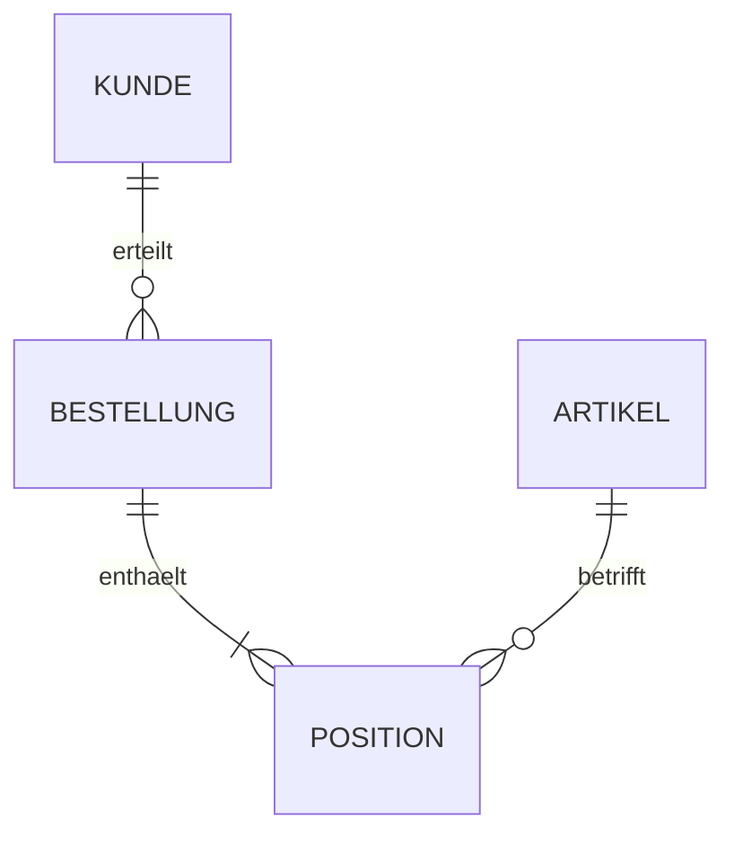

# Relationale Datenbanken und einfache ER-Modelle ohne SQL

## 1. Lernziele

Du kannst:

- DBMS, Relation, Tupel, Attribut und Domäne erklären;
- Primär-, Kandidaten-, Fremd- und zusammengesetzte Schlüssel unterscheiden;
- 1:1-, 1:n- und n:m-Beziehungen lesen und umsetzen;
- aus einer Anforderung ein einfaches ER-Modell und Tabellenschema entwickeln;
- Redundanzen, Anomalien und Integritätsverletzungen erkennen;
- den Zweck der ersten drei Normalformen auf Grundniveau begründen.

## 2. Prüfungsminimum — 15 Minuten

1. Tabelle/Relation enthält gleichartig strukturierte Datensätze; Zeile = Tupel, Spalte = Attribut.
2. Primärschlüssel identifiziert einen Datensatz eindeutig und darf nicht fehlen.
3. Fremdschlüssel verweist auf einen Schlüssel einer anderen Tabelle.
4. 1:n: Fremdschlüssel kommt gewöhnlich auf die n-Seite.
5. n:m: eigene Zwischentabelle mit zwei Fremdschlüsseln.
6. Zusammengesetzter Schlüssel besteht aus mehreren Attributen.
7. Redundanz fördert Änderungs-, Einfüge- und Löschanomalien.
8. Entitäts-, Referenz- und Domänenintegrität unterscheiden.
9. ER-Modell ist fachliche Struktur; konkretes relationales Schema ist die Umsetzung.
10. In diesem AP1-Kapitel wird keine SQL-Syntax benötigt.

> Die n:m-Beziehung zwischen Bestellung und Artikel wird durch die Zwischentabelle `Bestellposition` aufgelöst, da jede Bestellung mehrere Artikel und jeder Artikel mehrere Bestellungen betreffen kann.

## 3. Grundlagen

### 3.1 Begriffe

| Begriff | Bedeutung | Beispiel |
|---|---|---|
| Datenbank | organisierter Datenbestand | Auftragsdaten |
| DBMS | Software zur Verwaltung | PostgreSQL, SQL Server als Beispiele |
| Relation/Tabelle | gleichartig strukturierte Datensätze | Kunde |
| Tupel/Zeile | konkreter Datensatz | Kunde 4711 |
| Attribut/Spalte | Merkmal | Name |
| Domäne | zulässiger Wertebereich | Datum, positive Menge |
| Schema | definierte Struktur | Tabellen, Schlüssel, Regeln |

Ein DBMS verwaltet Speicherung, Abfrage, Änderung, Nebenläufigkeit, Rechte, Integrität und Wiederherstellung. Ein Tabellenprogramm ist nicht allein deshalb ein relationales DBMS, weil es Zeilen und Spalten zeigt.

### 3.2 Schlüssel

- `Kandidatenschlüssel`: jedes minimale Attributset, das einen Datensatz eindeutig identifiziert.
- `Primärschlüssel (PK)`: ausgewählter Kandidatenschlüssel.
- `Alternativschlüssel`: nicht ausgewählter Kandidatenschlüssel.
- `Fremdschlüssel (FK)`: verweist auf einen Schlüssel einer anderen Relation.
- `zusammengesetzter Schlüssel`: besteht aus mehreren Attributen.
- `künstlicher Schlüssel`: technisch erzeugte ID ohne fachliche Bedeutung.

Ein guter Primärschlüssel ist eindeutig, nicht leer und möglichst stabil. Ein Name ist gewöhnlich ungeeignet, weil er nicht eindeutig und nicht unveränderlich ist.

### 3.3 Kardinalitäten

| Beziehung | Aussage | relationale Umsetzung |
|---|---|---|
| 1:1 | je Seite höchstens/genau ein Partner nach Modell | FK auf geeigneter Seite plus Eindeutigkeit |
| 1:n | ein Datensatz hat viele auf Gegenseite | FK in Tabelle der n-Seite |
| n:m | viele auf beiden Seiten | Zwischentabelle |

Optionalität wird zusätzlich angegeben: `0..1`, `1`, `0..*`, `1..*`.

## 4. Vertiefung und Zusammenhänge

### 4.1 Beispielmodell



Relationales Schema:

```text
Kunde(
    KundenNr PK,
    Name,
    EMail UNIQUE
)

Bestellung(
    BestellNr PK,
    Datum,
    KundenNr FK → Kunde.KundenNr
)

Artikel(
    ArtikelNr PK,
    Bezeichnung,
    Preis
)

Position(
    BestellNr PK/FK → Bestellung.BestellNr,
    ArtikelNr PK/FK → Artikel.ArtikelNr,
    Menge
)
```

`Position` besitzt einen zusammengesetzten Primärschlüssel. Falls derselbe Artikel in einer Bestellung in mehreren getrennten Positionen vorkommen darf, ist ein anderes Schlüsselmodell nötig, etwa `PositionsNr`.

### 4.2 Redundanz und Anomalien

Werden Kundenname und Adresse in jeder Bestellung gespeichert:

- `Änderungsanomalie`: Adresse muss in vielen Zeilen geändert werden;
- `Einfügeanomalie`: Kunde lässt sich eventuell nicht ohne Bestellung speichern;
- `Löschanomalie`: Löschen der letzten Bestellung entfernt ungewollt Kundendaten.

Trennung in `Kunde` und `Bestellung` reduziert diese Redundanz. Vollständige Redundanzfreiheit ist nicht immer das Ziel; bewusste Denormalisierung braucht eine Leistungs-/Betriebsbegründung und konsistente Pflege.

### 4.3 Normalformen auf Grundniveau

`1. Normalform`:

- Werte sind im Modell atomar;
- keine wiederholenden Spaltengruppen wie `Artikel1`, `Artikel2`, `Artikel3`.

`2. Normalform`:

- 1NF erfüllt;
- Nichtschlüsselattribute hängen bei zusammengesetztem Schlüssel vom gesamten Schlüssel ab.

`3. Normalform`:

- 2NF erfüllt;
- Nichtschlüsselattribute hängen nicht transitiv von einem anderen Nichtschlüsselattribut ab.

Für AP1 ist meist wichtiger, Anomalien und sinnvolle Tabellenzerlegung zu erklären, als formale Beweise auswendig zu lernen. Umfang mit WBS abgleichen.

### 4.4 Integrität

| Integrität | Regel | Beispielverletzung |
|---|---|---|
| Entitätsintegrität | PK eindeutig und nicht NULL | zwei Kunden mit gleicher KundenNr |
| referenzielle Integrität | FK verweist auf vorhandenen Datensatz oder ist zulässig leer | Bestellung verweist auf unbekannten Kunden |
| Domänenintegrität | Wert passt zu Typ/Bereich | Menge `-4` trotz positiver Regel |
| fachliche Integrität | Geschäftsregel wird eingehalten | Enddatum vor Startdatum |

Löschregeln müssen fachlich festgelegt werden: Löschen verhindern, abhängige Daten löschen oder Beziehung lösen. Eine automatische Kaskade ist nicht immer richtig.

### 4.5 Datenschutz und Berechtigungen

Ein gutes Datenmodell löst nicht alle Datenschutzfragen. Zusätzlich nötig:

- Datenminimierung und Zweckbindung;
- Rollen- und Berechtigungskonzept;
- Protokollierung geeigneter Zugriffe;
- Aufbewahrungs- und Löschkonzept;
- Verschlüsselung, Backup und Wiederherstellung nach Schutzbedarf.

## 5. Anwendungsfall: Projektzuordnung

Anforderung:

- Ein Mitarbeiter kann an mehreren Projekten arbeiten.
- Ein Projekt hat mehrere Mitarbeiter.
- Pro Zuordnung werden Rolle und Wochenstunden gespeichert.
- Ein Mitarbeiter darf pro Projekt nur einmal zugeordnet sein.

ER-Aussage: `Mitarbeiter n:m Projekt`.

Schema:

```text
Mitarbeiter(MitarbeiterNr PK, Name)
Projekt(ProjektNr PK, Bezeichnung)
ProjektMitarbeiter(
    MitarbeiterNr PK/FK → Mitarbeiter.MitarbeiterNr,
    ProjektNr PK/FK → Projekt.ProjektNr,
    Rolle,
    Wochenstunden
)
```

Begründung:

- Zwischentabelle löst n:m auf;
- zusammengesetzter PK verhindert doppelte Zuordnung;
- `Rolle` und `Wochenstunden` gehören zur Beziehung, nicht nur zu Mitarbeiter oder Projekt;
- Domänenregel verhindert negative Wochenstunden.

Prüffälle:

1. neuer Mitarbeiter ohne Projekt: nach Optionalität erlaubt;
2. Projekt mit mindestens einem Mitarbeiter: ggf. fachlich sicherstellen;
3. doppelte Kombination: muss verhindert werden;
4. unbekannte ProjektNr: verletzt referenzielle Integrität;
5. negative Wochenstunden: verletzt Domänen-/Fachregel.

## 6. Prüfungsformulierungen

> Der Fremdschlüssel `KundenNr` wird in der Tabelle `Bestellung` gespeichert, da ein Kunde mehrere Bestellungen erteilen kann und die Bestellung damit auf genau einen Kunden verweist.

> Die Tabelle `ProjektMitarbeiter` ist erforderlich, weil die n:m-Beziehung zusätzliche Attribute wie Rolle und Wochenstunden besitzt.

> Die Trennung der Kundendaten von den Bestellungen vermeidet Änderungsanomalien, da eine Adressänderung nur an einer Stelle gespeichert werden muss.

> Ein zusammengesetzter Primärschlüssel aus Mitarbeiter- und Projektnummer verhindert, dass derselbe Mitarbeiter demselben Projekt mehrfach zugeordnet wird.

## 7. Typische Prüfungsfallen

- Primärschlüssel mit Fremdschlüssel verwechseln.
- Fremdschlüssel bei 1:n auf die falsche Seite setzen.
- n:m ohne Zwischentabelle lassen.
- Attribute der Beziehung einer Entität falsch zuordnen.
- Name oder E-Mail ungeprüft als stabilen Primärschlüssel wählen.
- Kardinalität und Optionalität verwechseln.
- Multiplizität nur in eine Richtung lesen.
- Tabelle mit wiederholenden Gruppen als normalisiert ansehen.
- Löschen mit Kaskade ohne fachliche Folgen wählen.
- Referenzielle Integrität mit Datensicherung verwechseln.
- SQL-Abfragen in den AP1-Grundlagenblock ziehen.
- Datenmodellierung mit Datenschutzfreigabe gleichsetzen.

## 8. Selbsttest

1. Unterscheide Tabelle, Zeile und Spalte.
2. Was ist ein Kandidatenschlüssel?
3. Wo liegt der FK bei `Kunde 1:n Bestellung`?
4. Wie wird n:m relational aufgelöst?
5. Nenne die drei klassischen Anomalien.
6. Erkläre Entitäts- und referenzielle Integrität.
7. Warum ist `Name` meist kein guter PK?
8. Modelliere `Autor n:m Buch` mit Attribut `Reihenfolge`.
9. Was bedeutet atomar in 1NF im jeweiligen Modell?
10. Welche Abhängigkeit beseitigt die 3NF auf Grundniveau?
11. Bewerte automatisches Kaskadenlöschen einer Kundenbestellung.
12. Nenne drei Datenschutzmaßnahmen außerhalb des ER-Modells.

<details>
<summary>Lösungen anzeigen</summary>

1. Tabelle = Relation, Zeile = Datensatz/Tupel, Spalte = Attribut.
2. Ein minimales Attributset, das Datensätze eindeutig identifiziert.
3. In `Bestellung`, der n-Seite.
4. Durch eine Zwischentabelle mit Fremdschlüsseln auf beide Seiten.
5. Änderungs-, Einfüge- und Löschanomalie.
6. PK eindeutig/nicht leer; FK verweist auf vorhandenen Zielschlüssel oder ist zulässig leer.
7. Namen sind nicht zwingend eindeutig oder stabil.
8. `AutorBuch(AutorNr PK/FK, BuchNr PK/FK, Reihenfolge)`.
9. Ein Attributwert wird nicht als wiederholende Liste mehrerer gleichartiger Werte modelliert.
10. Transitive Abhängigkeit eines Nichtschlüsselattributs von einem anderen Nichtschlüsselattribut.
11. Nur wenn fachlich und rechtlich erlaubt; sonst verhindern, archivieren oder gezielt behandeln.
12. Minimierung, Berechtigungen, Löschfristen, Protokollierung oder Verschlüsselung; drei genügen.

</details>

## 9. Quellen und Abgleich

- [BIBB: Fachinformatiker/Fachinformatikerin](https://www.bibb.de/dienst/publikationen/de/16661) — Ausbildungs- und Handlungskontext.
- [PostgreSQL-Dokumentation: Constraints](https://www.postgresql.org/docs/current/ddl-constraints.html) — offizielles Herstellerbeispiel zu Schlüssel- und Integritätsregeln; keine SQL-Syntax wird geprüft.
- Umfang ohne SQL gemäß aktueller AP1-Projektabgrenzung; Stand 10.09.2026.

## 10. Offene Prüfpunkte für den Unterricht

- Werden 1NF bis 3NF ausdrücklich verlangt oder nur Redundanz/Anomalien?
- Welche ER-Notation nutzt WBS für Kardinalitäten und Optionalität?
- Sind künstliche Schlüssel und Löschregeln Bestandteil der Aufgaben?
