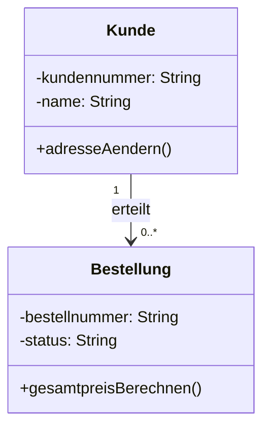
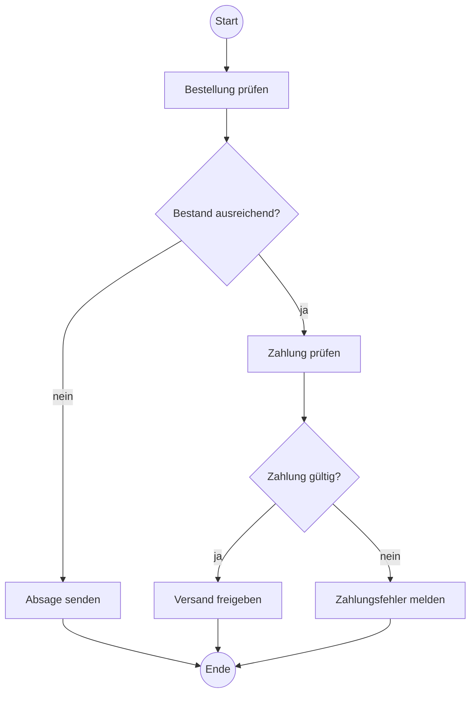

# UML: Use-Case-, Klassen- и Aktivitätsdiagramm

## 1. Lernziele

Ты сможешь:

- выбирать Use-Case-, Klassen- или Aktivitätsdiagramm по вопросу;
- моделировать Akteure, Systemgrenze и fachliche Anwendungsfälle;
- читать Klassen, Attribute, Methoden, Sichtbarkeiten и Multiplizitäten;
- показывать Entscheidungen, Schleifen и Parallelität в Aktivitätsdiagramm;
- находить ошибочные Modelle и обоснованно исправлять.

## 2. Prüfungsminimum — 15 Minuten

1. Use-Case-Diagramm: fachliche Ziele внешних Rollen по отношению к System.
2. Klassendiagramm: статическая структура Klassen, Merkmale и Beziehungen.
3. Aktivitätsdiagramm: Ablauf, Entscheidungen и Parallelität.
4. Akteur — Rolle вне рассматриваемой Systemgrenze, а не конкретный человек.
5. Use Case формулируется как fachliches Ziel с глаголом, не как экран или клик.
6. `<<include>>`: Basisfall обязательно включает переиспользуемое Verhalten.
7. `<<extend>>`: необязательное/условное Verhalten расширяет Basisfall.
8. Multiplizität стоит у того конца Assoziation, количество которого описывает.
9. Guards на Entscheidung должны быть однозначными и вместе полными.
10. Fork разделяет параллельные Pfade, Join синхронизирует их.

> Das Aktivitätsdiagramm wird verwendet, da nicht die statische Datenstruktur, sondern die Reihenfolge von Prüfungen, Entscheidungen und parallelen Arbeitsschritten dargestellt werden soll.

## 3. Use-Case-Diagramm

### 3.1 Элементы

| Element | Значение | Пример |
|---|---|---|
| Akteur | внешняя Rolle или externes System | Kunde, Sachbearbeiter, Zahlungsdienst |
| Use Case | fachliches Ziel/Funktion | Bestellung aufgeben |
| Systemgrenze | граница рассматриваемого System | Onlineshop |
| Assoziation | участие Akteur | Kunde использует Bestellung aufgeben |

Akteur может быть человеком, организацией, устройством или другой системой. Важна Rolle относительно моделируемого System.

### 3.2 Хорошее именование

Хорошо:

```text
Bestellung aufgeben
Rechnung prüfen
Passwort zurücksetzen
```

Плохо:

```text
Bestellmaske
Button klicken
Datenbank
```

Use Cases показывают Ziele, а не Oberfläche и не подробный Zeitablauf.

### 3.3 Include и Extend

```text
Bestellung aufgeben --<<include>>--> Identität prüfen
Gutschein anwenden --<<extend>>--> Bestellung aufgeben
```

- `include`: Basisfall регулярно/обязательно использует eingebundenen Teil.
- `extend`: Erweiterungsfall условно добавляет Verhalten к Basisfall.

Частая ошибка — Pfeilrichtung: `include` указывает на eingebundenen Use Case, `extend` — на erweiterten Basisfall.

Generalisierung выражает общие Rollen или Use Cases, но для простых AP1-Fälle менее важна, чем правильные Ziele и Beziehungen.

## 4. Klassendiagramm und Beziehungen

### 4.1 Строение Klasse

```text
Kunde
-------------------------
- kundennummer: String
- name: String
-------------------------
+ adresseAendern(neu: Adresse): Boolean
```

Sichtbarkeit:

```text
+ public
- private
# protected
~ package
```

Attribute описывают Zustand, Methoden — Verhalten. Datentypen и Rückgabetypen указываются, если требует задача.

### 4.2 Multiplizitäten

| Zeichen | Значение |
|---|---|
| `1` | ровно один |
| `0..1` | необязательно, максимум один |
| `*` или `0..*` | от нуля до любого количества |
| `1..*` | минимум один |
| `2..5` | от двух до пяти |

Пример:



Чтение:

- каждой Bestellung соответствует ровно один Kunde;
- Kunde может иметь от нуля до многих Bestellungen.

### 4.3 Assoziation, Aggregation и Komposition

- `Assoziation`: общая fachliche Beziehung.
- `Aggregation`: слабая Ganzes-Teil-Beziehung; части существуют независимо.
- `Komposition`: сильная Ganzes-Teil-Beziehung; Lebenszyklus части привязан к целому.

Aggregation/Komposition использовать только при fachlich belegter Lebenszyklus-Aussage. Обычная Assoziation лучше необоснованного ромба.

### 4.4 Klasse или Objekt

`Kunde` — Klasse. `kunde4711:Kunde` — Objekt/Instanz. Klassendiagramm моделирует Klassen; конкретные Instanzen показываются в Objektdiagramm или примере.

## 5. Aktivitätsdiagramm und Anwendungsfall

### 5.1 Основные элементы

| Element | Значение |
|---|---|
| Startknoten | начало Ablauf |
| Aktion | рабочий шаг |
| Kontrollfluss | порядок |
| Entscheidung | один Pfad по Guard |
| Merge | объединение альтернатив |
| Fork | запуск параллельных Pfade |
| Join | синхронизация Pfade |
| Endknoten | конец Ablauf |

### 5.2 Bestellprozess



Guards должны соответствовать условию. `[ja]`/`[nein]` понятно только при однозначной Entscheidungsfrage.

### 5.3 Parallelität

После успешной оплаты Rechnung erzeugen и Lager informieren могут начаться параллельно. Join нужен только если следующий шаг должен ждать оба результата.

Не путать Entscheidung и Fork:

- Entscheidung: один альтернативный Pfad по условию;
- Fork: несколько Pfade параллельно.

### 5.4 Сквозной Modellierungsfall

Anforderung: Kunde оформляет заказ, System проверяет Bestand и Zahlung, создаёт Rechnung и Versandauftrag.

Подходящие Sichten:

- Use Case: `Bestellung aufgeben`, Akteur `Kunde`, extern `Zahlungsdienst`;
- Klassendiagramm: `Kunde 1 — 0..* Bestellung`, `Bestellung 1 — 1..* Position`;
- Aktivitätsdiagramm: Prüfungen, Ablehnungswege, параллельные Rechnung/Versandvorbereitung.

Диаграммы не противоречат друг другу: они отвечают на разные вопросы.

## 6. Prüfungsformulierungen

> Der Akteur wird als Rolle „Sachbearbeiter“ und nicht mit einem Personennamen modelliert, weil das Diagramm die Interaktion einer Rolle mit dem System beschreibt.

> Die Multiplizität `0..*` an der Seite der Bestellung bedeutet, dass ein Kunde noch keine oder beliebig viele Bestellungen besitzen kann.

> Der Use Case „Identität prüfen“ wird mit `<<include>>` eingebunden, da diese Prüfung bei jeder Passwortänderung zwingend ausgeführt wird.

> Ein Fork ist erforderlich, da Rechnungserstellung und Lagerbenachrichtigung unabhängig parallel beginnen können.

## 7. Typische Prüfungsfallen

- Выбрать Diagrammtyp не по вопросу.
- Использовать конкретного человека вместо Rolle как Akteur.
- Без причины моделировать Datenbank/interne Klasse как внешнего Akteur.
- Называть UI-Schritte вместо fachlicher Ziele.
- Путать `include`/`extend` и Pfeilrichtung.
- Читать Multiplizität не у того конца.
- Путать Attribut и Methode.
- Путать `private` и `public`.
- Использовать Komposition без Lebenszyklusabhängigkeit.
- Путать Entscheidung и Parallelität.
- Делать Guards пересекающимися или неполными.
- Считать Aktivitätsdiagramm подробным Use-Case-Diagramm.

## 8. Selbsttest

1. Какое Diagramm показывает fachliche Ziele внешних Rollen?
2. Какое Diagramm показывает Multiplizitäten?
3. Какое Diagramm показывает Ablauf с Entscheidung?
4. Преврати «Bestellseite» в хороший Use Case.
5. Различи `include` и `extend`.
6. Прочитай `Kunde "1" — "0..*" Bestellung` в обе стороны.
7. Когда Komposition оправдана вместо Assoziation?
8. Что означают `+`, `-`, `#` у Klassenmerkmalen?
9. Различи Decision/Merge и Fork/Join.
10. Составь Guards для «Betrag mindestens 100 Euro».
11. Выбери диаграммы для Rollen, Datenstruktur и Ablauf Ticketsystem.
12. Оцени: «Use Cases показывают точный порядок каждого клика».

<details>
<summary>Lösungen anzeigen</summary>

1. Use-Case-Diagramm.
2. Klassendiagramm.
3. Aktivitätsdiagramm.
4. Например, `Bestellung aufgeben`.
5. Include — обязательное переиспользуемое Verhalten; Extend — условное/необязательное расширение.
6. Bestellung имеет одного Kunden; Kunde имеет 0..* Bestellungen.
7. Когда Teil и Ganzes имеют сильную fachliche Lebenszyklusabhängigkeit.
8. public, private, protected.
9. Decision/Merge управляет альтернативами; Fork/Join — параллельными Pfade.
10. `[betrag ≥ 100]` и `[betrag < 100]`.
11. Use Case, Klassendiagramm, Aktivitätsdiagramm.
12. Неверно: Use Cases показывают Ziele, подробный Ablauf относится к другим описаниям.

</details>

## 9. Quellen und Abgleich

- [OMG UML 2.5.1](https://www.omg.org/spec/UML/2.5.1/About-UML) — normative UML-Spezifikation и машинные модели.
- Сверено с текущим объёмом проекта по Klassen, Use Cases и Aktivitäten; Stand 10.09.2026.

## 10. Offene Prüfpunkte für den Unterricht

- Какую UML-Notation даёт WBS в Prüfungsaufgaben?
- Активно ли спрашиваются Aggregation/Komposition или только Assoziationen?
- Нужно ли рисовать `include`/`extend` или только распознавать?
