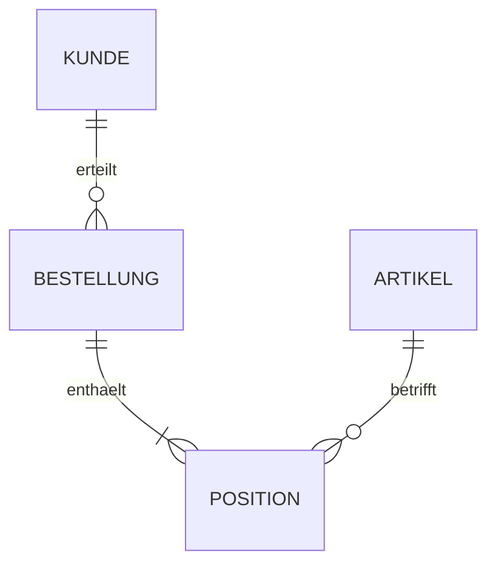

# Реляционные базы данных и простые ER-модели без SQL

## 1. Lernziele

Ты сможешь:

- объяснять DBMS, Relation, Tupel, Attribut и Domäne;
- различать Primär-, Kandidaten-, Fremd- и zusammengesetzte Schlüssel;
- читать и реализовывать 1:1-, 1:n- и n:m-Beziehungen;
- строить простое ER-Modell и Tabellenschema из требования;
- распознавать Redundanzen, Anomalien и Integritätsverletzungen;
- на базовом уровне объяснять первые три Normalformen.

## 2. Prüfungsminimum — 15 Minuten

1. Tabelle/Relation содержит однотипные Datensätze; Zeile = Tupel, Spalte = Attribut.
2. Primärschlüssel однозначно обозначает Datensatz и не может отсутствовать.
3. Fremdschlüssel ссылается на Schlüssel другой Tabelle.
4. 1:n: Fremdschlüssel обычно находится на n-Seite.
5. n:m: отдельная Zwischentabelle с двумя Fremdschlüsseln.
6. Zusammengesetzter Schlüssel состоит из нескольких Attributen.
7. Redundanz вызывает Änderungs-, Einfüge- и Löschanomalien.
8. Различать Entitäts-, Referenz- и Domänenintegrität.
9. ER-Modell — fachliche Struktur; relationales Schema — её реализация.
10. В этой главе AP1 SQL-Syntax не требуется.

> Die n:m-Beziehung zwischen Bestellung und Artikel wird durch die Zwischentabelle `Bestellposition` aufgelöst, da jede Bestellung mehrere Artikel und jeder Artikel mehrere Bestellungen betreffen kann.

## 3. Grundlagen

### 3.1 Понятия

| Begriff | Значение | Пример |
|---|---|---|
| Datenbank | организованный набор данных | Auftragsdaten |
| DBMS | ПО для управления | PostgreSQL, SQL Server как примеры |
| Relation/Tabelle | однотипные Datensätze | Kunde |
| Tupel/Zeile | конкретный Datensatz | Kunde 4711 |
| Attribut/Spalte | признак | Name |
| Domäne | допустимый диапазон значений | Datum, positive Menge |
| Schema | заданная структура | Tabellen, Schlüssel, Regeln |

DBMS управляет Speicherung, Abfrage, Änderung, Nebenläufigkeit, Rechten, Integrität и Wiederherstellung. Tabellenprogramm не становится relationales DBMS только из-за Zeilen/Spalten.

### 3.2 Schlüssel

- `Kandidatenschlüssel`: минимальный набор Attributen, однозначно определяющий Datensatz.
- `Primärschlüssel (PK)`: выбранный Kandidatenschlüssel.
- `Alternativschlüssel`: не выбранный Kandidatenschlüssel.
- `Fremdschlüssel (FK)`: ссылка на Schlüssel другой Relation.
- `zusammengesetzter Schlüssel`: несколько Attributen.
- `künstlicher Schlüssel`: технически созданный ID без fachliche Bedeutung.

Хороший Primärschlüssel однозначен, не пуст и стабилен. Name обычно плох: не обязательно уникален и неизменен.

### 3.3 Kardinalitäten

| Beziehung | Смысл | Relationale Umsetzung |
|---|---|---|
| 1:1 | с каждой стороны максимум/ровно один Partner | FK на подходящей стороне плюс Eindeutigkeit |
| 1:n | один Datensatz связан со многими | FK в Tabelle на n-Seite |
| n:m | много с обеих сторон | Zwischentabelle |

Optionalität задаётся отдельно: `0..1`, `1`, `0..*`, `1..*`.

## 4. Vertiefung und Zusammenhänge

### 4.1 Пример модели



Relationales Schema:

```text
Kunde(
    KundenNr PK,
    Name,
    EMail UNIQUE
)

Bestellung(
    BestellNr PK,
    Datum,
    KundenNr FK → Kunde.KundenNr
)

Artikel(
    ArtikelNr PK,
    Bezeichnung,
    Preis
)

Position(
    BestellNr PK/FK → Bestellung.BestellNr,
    ArtikelNr PK/FK → Artikel.ArtikelNr,
    Menge
)
```

`Position` имеет zusammengesetzten Primärschlüssel. Если один Artikel допускается в нескольких отдельных Positionen одного заказа, нужна другая модель ключа, например `PositionsNr`.

### 4.2 Redundanz и Anomalien

Если Kundenname и Adresse записывать в каждой Bestellung:

- `Änderungsanomalie`: Adresse нужно менять во многих Zeilen;
- `Einfügeanomalie`: Kunde нельзя сохранить без Bestellung;
- `Löschanomalie`: удаление последней Bestellung удалит Kundendaten.

Разделение `Kunde` и `Bestellung` уменьшает Redundanz. Полное отсутствие дублирования не всегда цель; Denormalisierung требует обоснования Leistung/Betrieb и согласованного обновления.

### 4.3 Normalformen на базовом уровне

`1. Normalform`:

- Werte атомарны в выбранной модели;
- нет повторяющихся Spaltengruppen `Artikel1`, `Artikel2`, `Artikel3`.

`2. Normalform`:

- выполнена 1NF;
- Nichtschlüsselattribute при zusammengesetztem Schlüssel зависят от всего Schlüssel.

`3. Normalform`:

- выполнена 2NF;
- Nichtschlüsselattribute не зависят транзитивно от другого Nichtschlüsselattribut.

Для AP1 обычно важнее объяснить Anomalien и разумное разбиение Tabellen, чем формальные доказательства. Umfang сверить с WBS.

### 4.4 Integrität

| Integrität | Regel | Пример нарушения |
|---|---|---|
| Entitätsintegrität | PK уникален и не NULL | два Kunden с одной KundenNr |
| referenzielle Integrität | FK ссылается на существующий Datensatz или допустимо пуст | Bestellung с неизвестным Kunden |
| Domänenintegrität | Wert соответствует Typ/Bereich | Menge `-4` при требовании положительности |
| fachliche Integrität | соблюдается Geschäftsregel | Enddatum раньше Startdatum |

Löschregeln задаются fachlich: запретить удаление, удалить зависимое или разорвать Beziehung. Автоматическая Kaskade не всегда правильна.

### 4.5 Datenschutz и Berechtigungen

Хорошая Datenmodell не решает все вопросы Datenschutz. Дополнительно нужны:

- Datenminimierung и Zweckbindung;
- Rollen- и Berechtigungskonzept;
- Protokollierung подходящих Zugriffe;
- Aufbewahrungs- и Löschkonzept;
- Verschlüsselung, Backup и Wiederherstellung по Schutzbedarf.

## 5. Anwendungsfall: назначение в проекты

Anforderung:

- Mitarbeiter работает в нескольких Projekten.
- Projekt имеет несколько Mitarbeiter.
- В Zuordnung записываются Rolle и Wochenstunden.
- Mitarbeiter может быть назначен в Projekt только один раз.

ER-Aussage: `Mitarbeiter n:m Projekt`.

Schema:

```text
Mitarbeiter(MitarbeiterNr PK, Name)
Projekt(ProjektNr PK, Bezeichnung)
ProjektMitarbeiter(
    MitarbeiterNr PK/FK → Mitarbeiter.MitarbeiterNr,
    ProjektNr PK/FK → Projekt.ProjektNr,
    Rolle,
    Wochenstunden
)
```

Обоснование:

- Zwischentabelle разрешает n:m;
- zusammengesetzter PK предотвращает двойное назначение;
- `Rolle` и `Wochenstunden` принадлежат Beziehung;
- Domänenregel запрещает отрицательные Stunden.

Prüffälle:

1. новый Mitarbeiter без Projekt: разрешён по Optionalität;
2. Projekt минимум с одним Mitarbeiter: обеспечить fachlich при необходимости;
3. двойная комбинация: должна блокироваться;
4. неизвестная ProjektNr: нарушает referenzielle Integrität;
5. отрицательные Wochenstunden: нарушают Domänen-/Fachregel.

## 6. Prüfungsformulierungen

> Der Fremdschlüssel `KundenNr` wird in der Tabelle `Bestellung` gespeichert, da ein Kunde mehrere Bestellungen erteilen kann und die Bestellung damit auf genau einen Kunden verweist.

> Die Tabelle `ProjektMitarbeiter` ist erforderlich, weil die n:m-Beziehung zusätzliche Attribute wie Rolle und Wochenstunden besitzt.

> Die Trennung der Kundendaten von den Bestellungen vermeidet Änderungsanomalien, da eine Adressänderung nur an einer Stelle gespeichert werden muss.

> Ein zusammengesetzter Primärschlüssel aus Mitarbeiter- und Projektnummer verhindert, dass derselbe Mitarbeiter demselben Projekt mehrfach zugeordnet wird.

## 7. Typische Prüfungsfallen

- Путать Primärschlüssel и Fremdschlüssel.
- Ставить FK при 1:n не на ту сторону.
- Оставлять n:m без Zwischentabelle.
- Неправильно относить Attribute der Beziehung к Entität.
- Выбирать Name/EMail как стабильный PK без проверки.
- Путать Kardinalität и Optionalität.
- Читать Multiplizität только в одном направлении.
- Считать Tabelle с повторяющимися Gruppen нормализованной.
- Выбирать Kaskadenlöschen без оценки Folgen.
- Путать referenzielle Integrität и Datensicherung.
- Втаскивать SQL-Abfragen в блок AP1-Grundlagen.
- Приравнивать Datenmodellierung к Datenschutzfreigabe.

## 8. Selbsttest

1. Различи Tabelle, Zeile и Spalte.
2. Что такое Kandidatenschlüssel?
3. Где FK при `Kunde 1:n Bestellung`?
4. Как реализуется n:m?
5. Назови три классические Anomalien.
6. Объясни Entitäts- и referenzielle Integrität.
7. Почему `Name` обычно плохой PK?
8. Смоделируй `Autor n:m Buch` с Attribut `Reihenfolge`.
9. Что означает atomar в 1NF для модели?
10. Какую зависимость устраняет 3NF на базовом уровне?
11. Оцени Kaskadenlöschen заказов Kunden.
12. Назови три Datenschutzmaßnahmen вне ER-Modell.

<details>
<summary>Lösungen anzeigen</summary>

1. Tabelle = Relation, Zeile = Datensatz/Tupel, Spalte = Attribut.
2. Минимальный набор Attributen, однозначно определяющий Datensätze.
3. В `Bestellung`, на n-Seite.
4. Через Zwischentabelle с Fremdschlüsseln на обе стороны.
5. Änderungs-, Einfüge-, Löschanomalie.
6. PK уникален/не пуст; FK ссылается на существующий Zielschlüssel или допустимо пуст.
7. Namen не обязательно уникальны или стабильны.
8. `AutorBuch(AutorNr PK/FK, BuchNr PK/FK, Reihenfolge)`.
9. Attributwert не моделируется как повторяющийся список однотипных значений.
10. Transitive Abhängigkeit Nichtschlüsselattribut от другого Nichtschlüsselattribut.
11. Только если fachlich и rechtlich допустимо; иначе запретить, архивировать или обработать точечно.
12. Minimierung, Berechtigungen, Löschfristen, Protokollierung, Verschlüsselung; любые три.

</details>

## 9. Quellen und Abgleich

- [BIBB: Fachinformatiker/Fachinformatikerin](https://www.bibb.de/dienst/publikationen/de/16661) — Ausbildungs- и Handlungskontext.
- [PostgreSQL-Dokumentation: Constraints](https://www.postgresql.org/docs/current/ddl-constraints.html) — официальный пример Schlüssel- и Integritätsregeln; SQL-Syntax здесь не проверяется.
- Umfang без SQL по текущему разграничению AP1 проекта; Stand 10.09.2026.

## 10. Offene Prüfpunkte für den Unterricht

- Требуются ли 1NF–3NF явно или только Redundanz/Anomalien?
- Какую ER-Notation использует WBS для Kardinalitäten/Optionalität?
- Входят ли künstliche Schlüssel и Löschregeln в задания?
